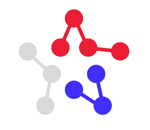

# Awesome Project 🚀

## Описание

Этот проект — современный, масштабируемый и надежный backend-сервис, построенный с использованием лучших технологий для разработки REST API.  
Идеально подходит для создания высоконагруженных приложений с асинхронной обработкой задач и надежным хранением данных.

---

## Стек технологий

| Технология   | Описание                                      |
|--------------|-----------------------------------------------|
| **Django REST Framework (DRF)** | Мощный и гибкий фреймворк для создания REST API на Python |
| **PostgreSQL**                  | Надежная и производительная реляционная СУБД              |
| **Celery**                     | Асинхронная очередь задач для обработки фоновых задач     |
| **Redis**                      | Быстрое хранилище данных и брокер сообщений для Celery    |

---

## Возможности

- Полностью RESTful API с аутентификацией и авторизацией
- Асинхронная обработка фоновых задач (отправка email, обработка данных и т.д.)
- Надежное хранение данных с использованием PostgreSQL
- Высокая производительность и масштабируемость благодаря Redis и Celery
- Легкая интеграция и расширяемость

---
